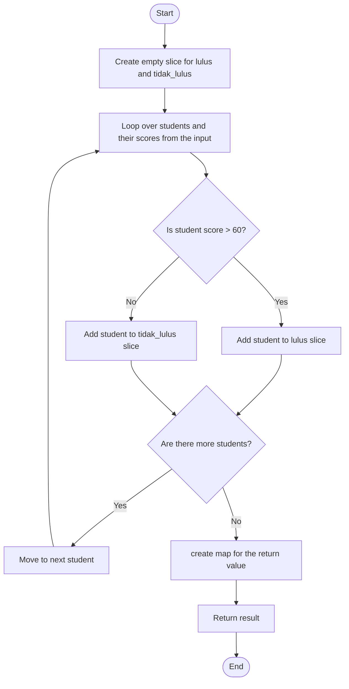

```mermaid
flowchart TD
    A([Start]) --> B[Create empty slice for lulus and tidak_lulus]
    B --> C[Loop over students and their scores from the input]
    C --> D{Is student score > 60?}
    D -- Yes --> E[Add student to lulus slice] --> H{Are there more students?}
    D -- No --> F[Add student to tidak_lulus slice] --> H
    H -- Yes --> I[Move to next student]
    I --> C
    H -- No --> J[create map for the return value]
    J --> K[Return result] --> END([End])
```